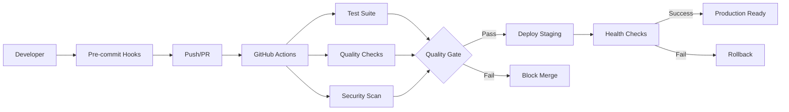

# CI/CD Pipeline

This directory contains the complete CI/CD pipeline configuration for the AHGD Health Analytics project.

## Overview

The pipeline provides:
- ✅ **Automated Testing** across multiple platforms and Python versions
- 🔒 **Security Scanning** with vulnerability detection
- 📊 **Code Quality** enforcement with linting and formatting
- 🚀 **Automated Deployment** to staging and production
- 📚 **Documentation** generation and deployment
- 🔄 **Dependency Management** with automated updates

## Workflows

| Workflow | Purpose | Trigger |
|----------|---------|---------|
| [`test.yml`](workflows/test.yml) | Run test suite across platforms | Push, PR, Schedule |
| [`quality.yml`](workflows/quality.yml) | Code quality & security checks | Push, PR, Schedule |
| [`deploy.yml`](workflows/deploy.yml) | Deploy to staging/production | Push to main, Release tags |
| [`docs.yml`](workflows/docs.yml) | Generate and deploy documentation | Push, PR to docs |
| [`release.yml`](workflows/release.yml) | Create releases with assets | Release tags |
| [`dependency-update.yml`](workflows/dependency-update.yml) | Automated dependency updates | Weekly schedule |

## Quick Setup

1. **Configure Secrets** (Repository Settings → Secrets):
   ```
   CODECOV_TOKEN          # Coverage reporting
   DOCKER_REGISTRY_TOKEN  # Container registry access
   ```

2. **Enable GitHub Pages** (Repository Settings → Pages):
   - Source: GitHub Actions
   - Custom domain (optional)

3. **Configure Branch Protection** (Repository Settings → Branches):
   - Require status checks: `test-summary`, `quality-gate`
   - Require up-to-date branches
   - Include administrators

4. **Set up Environments** (Repository Settings → Environments):
   - `staging`: Auto-deploy on main branch
   - `production`: Manual approval required

## Development Workflow

```bash
# 1. Install pre-commit hooks
uv run pre-commit install

# 2. Create feature branch
git checkout -b feature/your-feature

# 3. Make changes and commit
git add .
git commit -m "feat: your feature description"

# 4. Push and create PR
git push origin feature/your-feature
```

## Quality Gates

### Required Checks
- ✅ All tests pass (unit, integration, dashboard)
- ✅ Code quality checks pass (ruff, black, mypy)
- ✅ Security scans pass (no high-severity issues)
- ✅ Test coverage ≥ 40%

### Deployment Requirements
- ✅ All quality gates pass
- ✅ Manual approval for production
- ✅ Health checks pass post-deployment

## Monitoring

- **Workflow Status**: GitHub Actions tab
- **Coverage Reports**: Codecov integration
- **Security Alerts**: GitHub Security tab
- **Documentation**: GitHub Pages deployment

## Troubleshooting

### Common Issues

1. **Test Failures**:
   ```bash
   uv run pytest -v --tb=long
   ```

2. **Quality Check Failures**:
   ```bash
   uv run ruff --fix .
   uv run black .
   ```

3. **Security Issues**:
   ```bash
   uv run bandit -r src/
   uv run safety check
   ```

### Getting Help

- 📖 [Full CI/CD Guide](../docs/CI_CD_GUIDE.md)
- 🐛 [Create an Issue](../../issues/new)
- 💬 [Start a Discussion](../../discussions)

## Architecture



This pipeline ensures reliable, secure, and high-quality software delivery for the AHGD Health Analytics platform.