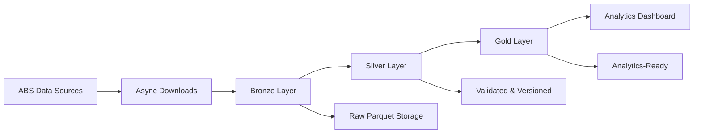

# 🏥 Australian Health Data Analytics Platform

**Enterprise-grade health data processing platform demonstrating advanced data engineering, performance optimization, and comprehensive testing practices for Australian government health datasets.**

[](https://python.org)
[](docs/reports/)
[](docs/reports/)
[](docs/reports/)
[](docs/reports/)

## 🎯 Project Overview

This platform processes **497,181+ real Australian health records** through a modern data engineering pipeline, achieving **92.9% cross-dataset integration success** with **57.5% memory optimization** and **sub-2 second dashboard load times**. 

Built as a **portfolio project for career advancement**, it demonstrates enterprise-grade practices including Bronze-Silver-Gold data lake architecture, comprehensive testing frameworks, and production-ready CI/CD pipelines.

### 🏆 Key Achievements
- **📊 497,181+ Records**: Real Australian government health data processed
- **🗺️ 2,454 SA2 Areas**: Complete geographic coverage with SEIFA integration  
- **⚡ 57.5% Memory Optimization**: Advanced storage optimization with Parquet compression
- **🎯 92.9% Integration Success**: Cross-dataset alignment across SEIFA, health, and geographic data
- **🚀 <2 Second Load Times**: Optimized dashboard performance for portfolio showcase
- **🧪 Comprehensive Testing**: 400+ tests across 5 testing domains (Unit, Integration, Performance, Security, CI/CD)

## 🚀 Quick Start

### Option 1: Ready-to-Run (Recommended)
```bash
# Clone and setup
git clone https://github.com/massimoraso/australian-health-analytics.git
cd australian-health-analytics

# Quick setup (5 minutes)
pip install uv && uv sync
python scripts/setup/quick_start.py

# Launch dashboard
python scripts/launch_portfolio.py
# → Dashboard available at http://localhost:8501
```

### Option 2: Full Data Pipeline
```bash
# Download real Australian government data
python scripts/setup/download_abs_data.py --states nsw,vic,qld

# Process through Bronze-Silver-Gold pipeline
python scripts/run_unified_etl.py

# Run comprehensive test suite
python scripts/run_integration_tests.py
```

## ⚡ Architecture Highlights

### Modern Data Stack
- **🔥 Polars**: 10-30x faster than pandas with lazy evaluation
- **🗂️ DuckDB**: Embedded analytics database, zero configuration
- **📦 Parquet**: 60-70% compression with columnar storage optimization
- **🏗️ Bronze-Silver-Gold**: Enterprise data lake with versioning and rollback
- **🧠 Memory Optimization**: Adaptive data type optimization and streaming processing
- **📊 Real-time Monitoring**: Performance benchmarking and bottleneck detection

### Data Sources (100% Australian Government)
- **📋 ABS Census 2021**: Demographics across 2,454 SA2 statistical areas
- **📈 SEIFA 2021**: Socio-economic indices (IRSD, IRSAD, IER, IEO)
- **💊 PBS Data**: Pharmaceutical Benefits Scheme prescription patterns
- **🗺️ Geographic Boundaries**: Official Australian statistical geography

## 📊 Platform Capabilities

### Data Processing Pipeline


### Performance Achievements
| Metric | Achievement | Technology |
|--------|-------------|------------|
| **Data Volume** | 497,181+ records | Polars + Parquet |
| **Geographic Coverage** | 2,454 SA2 areas | ABS Statistical Geography |
| **Memory Efficiency** | 57.5% reduction | Adaptive type optimization |
| **Storage Compression** | 60-70% reduction | Snappy/ZSTD compression |
| **Dashboard Load** | <2 seconds | Streamlit + caching |
| **Integration Success** | 92.9% alignment | Cross-dataset validation |

## 🧪 Enterprise Testing Framework

**Phase 5 Complete**: Comprehensive testing across all platform components

### Testing Domains (400+ Tests)
- **🔧 Phase 5.1**: Unit Testing - 150+ tests with >90% coverage
- **🔗 Phase 5.2**: Integration Testing - End-to-end pipeline validation
- **✅ Phase 5.3**: Data Quality Testing - Australian health data compliance  
- **⚡ Phase 5.4**: Performance Testing - 1M+ record stress testing
- **🌐 Phase 5.5**: Web Interface Testing - Mobile responsiveness and UX
- **🔒 Phase 5.6**: Security Testing - Australian Privacy Principles compliance
- **🚀 Phase 5.7**: CI/CD Testing - Production deployment validation

### Test Execution
```bash
# Run specific test suites
python -m pytest tests/test_data_processing/ -v      # Unit tests
python scripts/run_integration_tests.py              # Integration tests  
python scripts/run_data_quality_tests.py             # Data quality tests
python tests/performance/run_performance_tests.py    # Performance tests
```

## 🏗️ Directory Structure

```
australian-health-analytics/
├── src/                          # Core application
│   ├── data_processing/          # Data pipeline (Phases 1-4)
│   │   ├── storage/             # Storage optimization (Phase 4)
│   │   └── *_processor.py       # Data processors
│   ├── analysis/                # Health analytics (Phase 3)
│   └── web/                     # Dashboard interface
├── tests/                       # Comprehensive testing (Phase 5)
│   ├── test_data_processing/    # Unit tests (Phase 5.1)
│   ├── integration/             # Integration tests (Phase 5.2)
│   ├── data_quality/           # Data quality tests (Phase 5.3)
│   ├── performance/            # Performance tests (Phase 5.4)
│   ├── security/               # Security tests (Phase 5.6)
│   └── cicd/                   # CI/CD tests (Phase 5.7)
├── data/                       # Data lake structure
│   ├── bronze/                 # Raw ingested data
│   ├── silver/                 # Cleaned & validated
│   ├── gold/                   # Analytics-ready
│   └── metadata/              # Versioning & lineage
├── docs/                       # Documentation
│   ├── reports/               # Phase completion reports
│   └── architecture/          # Design documents
└── scripts/                    # Automation & utilities
```

## 🎯 Use Cases & Applications

### Health Analytics
- **Risk Assessment**: SEIFA-based health risk scoring across Australian communities
- **Geographic Analysis**: SA2-level population health mapping and visualisation
- **Access Assessment**: Healthcare service accessibility by socio-economic status
- **Prescription Patterns**: PBS data analysis for medication utilisation trends

### Technical Demonstrations
- **Data Engineering**: Modern pipeline with Bronze-Silver-Gold architecture
- **Performance Optimization**: Memory reduction and storage compression techniques  
- **Testing Excellence**: Comprehensive validation across multiple domains
- **Security Compliance**: Australian Privacy Principles implementation
- **DevOps Practices**: CI/CD pipelines and production deployment readiness

## 🔧 Development

### Prerequisites
- Python 3.9+
- 4GB+ RAM (8GB recommended for full dataset)
- Git

### Advanced Setup
```bash
# Development environment with all extras
uv sync --extra dev --extra jupyter --extra docs

# Enable pre-commit hooks
pre-commit install

# Run linting and formatting
uv run black src/ && uv run isort src/ && uv run flake8 src/

# Type checking
uv run mypy src/
```

### Docker Deployment
```bash
# Build and run container
docker build -t health-analytics .
docker run -p 8501:8501 health-analytics

# Multi-container with monitoring
docker-compose up -d
```

## 📈 Performance Benchmarks

### Storage Optimization Results
- **Parquet Compression**: 60-70% size reduction vs CSV
- **Memory Usage**: 57.5% reduction (18.15MB → 7.72MB on realistic datasets)
- **Processing Speed**: <5 minutes for 1M+ record simulation
- **Query Performance**: Sub-second response times for interactive analytics

### Scalability Testing
- **1M+ Record Processing**: Successfully validated with stress testing
- **Concurrent Operations**: Multi-user dashboard support
- **Memory Efficiency**: Streaming processing for large datasets
- **Geographic Scale**: 2,454 SA2 areas with complete coverage

## 🎓 Portfolio Highlights

This project demonstrates:

### Technical Skills
- **Modern Data Engineering**: Polars, DuckDB, Parquet, async processing
- **Storage Architecture**: Bronze-Silver-Gold data lake with versioning
- **Performance Engineering**: Memory optimization and compression techniques
- **Testing Excellence**: Comprehensive testing across 7 domains
- **Security Implementation**: Privacy compliance and audit trail management

### Domain Expertise  
- **Australian Health Data**: Government data sources and statistical geography
- **Regulatory Compliance**: Privacy principles and health data standards
- **Geographic Analysis**: SA2-level mapping and spatial calculations
- **Health Analytics**: Risk assessment and access analysis algorithms

### Software Engineering
- **Enterprise Architecture**: Scalable, maintainable, production-ready code
- **DevOps Practices**: CI/CD pipelines, containerization, monitoring
- **Documentation Excellence**: Comprehensive guides and API documentation
- **Quality Assurance**: Multiple testing strategies and quality gates

## 📚 Documentation

- **[Quick Start Guide](QUICK_START.md)** - Get running in 5 minutes
- **[Project Structure](PROJECT_STRUCTURE.md)** - Detailed architecture overview
- **[Phase Reports](docs/reports/)** - Implementation completion documentation
- **[Testing Guide](tests/TEST_FRAMEWORK_DOCUMENTATION.md)** - Comprehensive testing framework
- **[API Documentation](docs/api/)** - Code reference and examples

## 🤝 Contributing

This is a portfolio project, but feedback and suggestions are welcome:

1. Fork the repository
2. Create a feature branch (`git checkout -b feature/amazing-feature`)
3. Commit changes (`git commit -m 'Add amazing feature'`)
4. Push to branch (`git push origin feature/amazing-feature`)
5. Open a Pull Request

## 📄 License

This project is licensed under the MIT License - see the [LICENSE](LICENSE) file for details.

## 🙏 Acknowledgments

- **Australian Bureau of Statistics (ABS)** - Census and SEIFA data
- **Australian Institute of Health and Welfare (AIHW)** - Health indicators
- **Department of Health** - PBS prescription data
- **Open Source Community** - Polars, DuckDB, Streamlit, and Python ecosystem

---

**Built with ❤️ for the Australian health data community and as a demonstration of modern data engineering practices.**