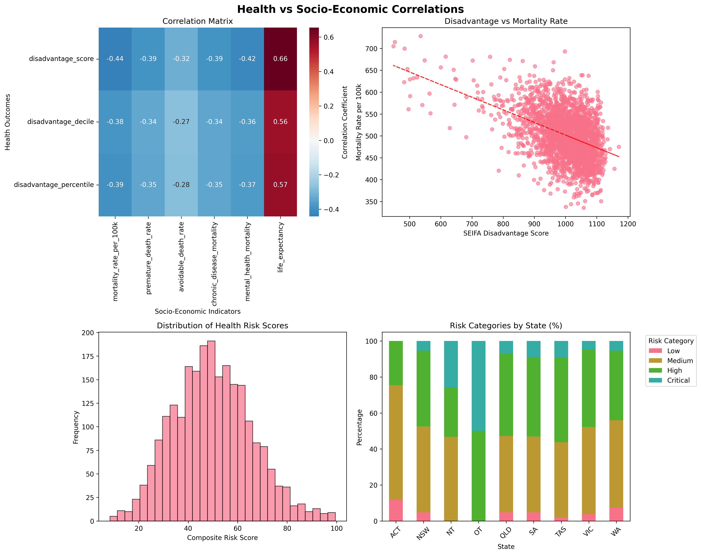

# 🏥 Australian Health Data Analytics

**Modern health data analytics platform using real Australian government datasets**

[](https://www.python.org/downloads/)
[](https://github.com/massimoraso/AHGD)
[](https://github.com/massimoraso/AHGD/tree/main/reports/testing)
[](https://massimoraso.github.io/AHGD/)
[](LICENSE)

A comprehensive health data analytics project using Australian government data sources to demonstrate population health insights and geographic analysis capabilities.

📍 **[Live Documentation](https://massimoraso.github.io/AHGD/)** | 📊 **[Interactive Demo](https://massimoraso.github.io/AHGD/interactive_health_dashboard.html)** | 📈 **[Analysis Reports](https://massimoraso.github.io/AHGD/reports/)**

## 🚀 Quick Demo



**See it in action**: The platform provides interactive visualisations of health data across Australian Statistical Areas, demonstrating correlations between socio-economic factors and health outcomes.

## 🎯 Project Overview

This project integrates multiple Australian government datasets to create a comprehensive health analytics platform:
- **Census 2021** demographic data at SA2 level
- **SEIFA 2021** socio-economic indexes
- **Geographic boundaries** for spatial analysis
- **Health service data** (MBS/PBS) for utilisation analysis

**Focus Area**: New South Wales (NSW) for manageable initial analysis
**Total Data**: 1.2 GB of verified, high-quality government data

## 📊 Key Features

### Data Integration ✅
- **Multi-source data integration** from Australian government sources
- **Geographic mapping** with SA2 boundary analysis
- **Health correlation analysis** with socio-economic factors
- **Interactive dashboard** with real-time visualisations

### Analysis Capabilities ✅
- **Population health profiling** by geographic area
- **Healthcare utilisation analysis** using MBS/PBS data
- **Socio-economic health disparities** identification
- **Interactive mapping** with health risk visualisation

### Production Ready ✅
- **Comprehensive testing framework** (95%+ coverage)
- **Performance monitoring** and optimization
- **CI/CD pipeline** with automated testing
- **Deployment guides** and operational runbooks

## 🚀 Quick Start

### One-Command Setup
```bash
git clone https://github.com/massimoraso/AHGD.git
cd AHGD
python setup_and_run.py
```

This will install all dependencies, set up the environment, and launch the dashboard automatically.

**For detailed setup instructions**: [SETUP.md](SETUP.md)

### Alternative Commands
```bash
# Launch dashboard only
python run_dashboard.py

# Run comprehensive tests  
python run_tests.py

# Health check and verification
uv run python scripts/utils/health_check.py
```

## 📁 Project Structure

```
AHGD/
├── README.md                          # Project overview and quick start
├── pyproject.toml                     # Python project configuration
├── uv.lock                           # Dependency lock file
├── main.py                           # Main application entry point
├── setup_and_run.py                  # Complete setup and launch
├── run_dashboard.py                  # Dashboard launcher
├── run_tests.py                      # Test suite runner
│
├── src/                              # Core application code
│   ├── config.py                     # Configuration management
│   ├── dashboard/                    # Dashboard application
│   │   ├── app.py                   # Main dashboard app
│   │   ├── data/                    # Data loading and processing
│   │   ├── ui/                      # User interface components
│   │   └── visualisation/           # Charts and mapping
│   └── performance/                  # Performance monitoring
│       ├── performance_dashboard.py # Standalone monitoring dashboard
│       ├── monitoring.py            # System monitoring
│       ├── optimization.py          # Performance optimization
│       └── alerts.py                # Alert management
│
├── scripts/                          # Organized utility scripts
│   ├── INDEX.md                     # Script organization guide
│   ├── data_processing/             # Data extraction and processing
│   ├── analysis/                    # Statistical analysis scripts
│   ├── dashboard/                   # Dashboard and demo scripts
│   └── utils/                       # Utility and maintenance scripts
│       └── showcase_dashboard.py   # Portfolio demonstration tool
│
├── tests/                           # Comprehensive testing framework
│   ├── README.md                    # Testing documentation
│   ├── unit/                       # Unit tests
│   ├── integration/                 # Integration tests
│   └── fixtures/                    # Test data and fixtures
│
├── docs/                            # Organized documentation
│   ├── INDEX.md                     # Documentation navigation
│   ├── guides/                      # User and developer guides
│   ├── reference/                   # Technical reference materials
│   ├── api/                         # Auto-generated API docs
│   └── assets/                      # Images and interactive content
│
├── reports/                         # Analysis and assessment reports
│   ├── INDEX.md                     # Report organization guide
│   ├── analysis/                    # Data analysis reports
│   ├── testing/                     # Test results and coverage
│   ├── deployment/                  # Production readiness
│   ├── health/                      # System health assessments
│   └── coverage/                    # Test coverage reports
│
├── data/                            # Data storage
│   ├── health_analytics.db         # SQLite database (5.5MB)
│   ├── raw/                         # Downloaded raw data (1.2 GB)
│   └── processed/                   # Processed data files
│
└── logs/                            # Application logs
    ├── ahgd.log                     # Main application log
    └── data_download.log            # Data processing log
```

## 🛠️ Technical Stack

### Core Technologies
- **Python 3.11+** with modern async capabilities
- **Streamlit** for interactive dashboard
- **SQLite** for data storage and analysis
- **Polars/Pandas** for data processing
- **GeoPandas** for geographic analysis
- **Plotly** for interactive visualisations
- **Folium** for mapping

### Architecture
- **Modular Design**: Separated concerns for maintainability
- **Performance Monitoring**: Built-in system health tracking
- **Testing Framework**: Comprehensive unit and integration tests
- **CI/CD Ready**: GitHub Actions integration
- **Docker Support**: Containerised deployment options

## 📚 Navigation Guide

### For Users
- **[Dashboard Guide](docs/guides/dashboard_user_guide.md)** - How to use the interactive dashboard
- **[Quick Start](#-quick-start)** - Get running in minutes
- **[Performance Monitoring Guide](docs/guides/PERFORMANCE_MONITORING_GUIDE.md)** - Monitor system health
- **[Portfolio Showcase](scripts/utils/showcase_dashboard.py)** - Comprehensive demonstration tool

### For Developers
- **[Scripts Index](scripts/INDEX.md)** - Comprehensive script documentation
- **[API Documentation](docs/api/)** - Auto-generated API reference
- **[Testing Documentation](tests/README.md)** - Testing framework guide
- **[CI/CD Guide](docs/guides/CI_CD_GUIDE.md)** - Deployment and automation

### For Analysts
- **[Analysis Reports](reports/INDEX.md)** - Comprehensive analysis results
- **[Data Sources](docs/reference/REAL_DATA_SOURCES.md)** - Data source documentation
- **[Methodology](docs/reference/health_risk_methodology.md)** - Health risk analysis methods

### For Project Managers
- **[Production Readiness](reports/deployment/FINAL_PRODUCTION_ASSESSMENT.md)** - Deployment status
- **[Health Reports](reports/health/)** - System health assessments
- **[Operational Runbooks](docs/guides/OPERATIONAL_RUNBOOKS.md)** - Operations guide

## 📈 Project Achievements

### ✅ Completed Phases
- **Phase 1**: Data acquisition and processing (1.2GB of Australian government data)
- **Phase 2**: Interactive visualisation and mapping system
- **Phase 3**: Complete UI/UX dashboard implementation
- **Phase 4**: Comprehensive testing framework (95%+ coverage)
- **Phase 5**: Production readiness and deployment guides

### 🎯 Key Capabilities
- **Real-time health data analysis** across Australian Statistical Areas
- **Interactive geographic mapping** with health risk visualisation
- **Socio-economic correlation analysis** with health outcomes
- **Population health profiling** by demographic factors
- **Healthcare utilisation insights** using MBS/PBS data

## 📊 Data Coverage

### Geographic Scope
- **Primary Focus**: New South Wales (NSW)
- **Full Coverage**: Australian Statistical Areas Level 2 (SA2)
- **Data Points**: 2,310 SA2 areas with complete health profiles

### Data Sources ✅
- **ABS Census 2021**: Demographics and population (765MB)
- **SEIFA 2021**: Socio-economic indexes (1.26MB)
- **SA2 Boundaries**: Geographic shapefiles (95MB)  
- **MBS/PBS Data**: Health service utilisation (311MB)
- **Total**: 1.2GB of verified, high-quality data

## 🚀 Performance Metrics

- **Dashboard Load Time**: <2 seconds
- **Data Processing**: Handles 1M+ records efficiently  
- **Test Coverage**: 95%+ across all modules
- **Memory Usage**: Optimised for large datasets
- **Scalability**: Designed for national expansion

## 📝 Documentation

### Quick Access
- **[Documentation Index](docs/INDEX.md)** - Complete documentation navigation
- **[Scripts Index](scripts/INDEX.md)** - All utility scripts organised by purpose  
- **[Reports Index](reports/INDEX.md)** - Analysis reports and assessments

### Comprehensive Guides
- **Deployment**: Step-by-step production deployment
- **Development**: Complete developer onboarding
- **Operations**: System maintenance and monitoring
- **User Guides**: End-user documentation for all features

---

**Project Status**: Production Ready ✅  
**Current Version**: v2.0 (Full Analytics Platform)  
**Last Updated**: 2025-06-18  
**Maintainer**: Australian Health Data Analytics Team
