# AHGD ETL Pipeline Data Lineage Overview

## Complete Data Flow Architecture

```mermaid
flowchart TD
    %% Data Sources
    subgraph sources [External Data Sources]
        AIHW[Australian Institute of Health and Welfare]
        ABS[Australian Bureau of Statistics]
        BOM[Bureau of Meteorology]
        MEDICARE[Department of Health]
        
        subgraph aihw_data [AIHW Data Types]
            AIHW_MORT[Mortality Data<br/>GRIM Database]
            AIHW_HOSP[Hospitalisation Data<br/>NHMD]
            AIHW_IND[Health Indicators<br/>Performance Framework]
            AIHW_MED[Medicare Analytics]
        end
        
        subgraph abs_data [ABS Data Types]
            ABS_GEO[Geographic Boundaries<br/>ASGS 2021]
            ABS_CENSUS[Census 2021<br/>Population & Demographics]
            ABS_SEIFA[SEIFA 2021<br/>Socioeconomic Indices]
            ABS_POST[Postcode Correspondences]
        end
        
        subgraph bom_data [BOM Data Types]
            BOM_CLIMATE[Climate & Weather Data]
            BOM_STATIONS[Weather Station Metadata]
            BOM_AIR[Air Quality & Environment]
        end
        
        subgraph medicare_data [Medicare/PBS Data]
            MED_UTIL[Medicare Utilisation<br/>MBS Services]
            PBS_PRESC[PBS Prescriptions]
            HEALTH_SERV[Healthcare Services<br/>Locations & Access]
        end
    end
    
    %% Connect sources to data types
    AIHW --> aihw_data
    ABS --> abs_data
    BOM --> bom_data
    MEDICARE --> medicare_data
    
    %% Extraction Layer
    subgraph extraction [Data Extraction Layer]
        direction TB
        EXT_REG[Extractor Registry<br/>Dependency Management]
        
        subgraph extractors [Source-Specific Extractors]
            AIHW_EXT[AIHW Extractors<br/>Priority: 85-90]
            ABS_EXT[ABS Extractors<br/>Priority: 75-95]
            BOM_EXT[BOM Extractors<br/>Priority: 70-78]
            MED_EXT[Medicare/PBS Extractors<br/>Priority: 76-85]
        end
        
        RAW_DATA[(Raw Data Store<br/>data_raw/)]
    end
    
    %% Connect data types to extractors
    aihw_data --> AIHW_EXT
    abs_data --> ABS_EXT
    bom_data --> BOM_EXT
    medicare_data --> MED_EXT
    
    EXT_REG --> extractors
    extractors --> RAW_DATA
    
    %% Transformation Layer
    subgraph transformation [Data Transformation Layer]
        direction TB
        
        subgraph integration [Data Integration Pipeline]
            SA2_AGG[SA2 Data Aggregator<br/>Geographic Standardisation]
            DATA_INT[Master Data Integrator<br/>Source Conflict Resolution]
            IND_CALC[Health Indicator Calculator<br/>Derived Metrics]
            DEMO_BUILD[Demographic Profile Builder<br/>Population Analytics]
            QUAL_CALC[Quality Score Calculator<br/>Data Reliability Assessment]
        end
        
        subgraph processors [Specialised Processors]
            BOUND_PROC[Boundary Processor<br/>Geographic Harmonisation]
            COORD_TRANS[Coordinate Transformer<br/>CRS Standardisation]
            GEO_STD[Geographic Standardiser<br/>SA2 Alignment]
            DENORM[Denormaliser<br/>Analytics Optimisation]
            DERIV_IND[Derived Indicators<br/>Calculated Metrics]
        end
        
        MASTER_RECORD[(Master Health Record<br/>data_processed/)]
    end
    
    RAW_DATA --> integration
    integration --> processors
    processors --> MASTER_RECORD
    
    %% Validation Layer
    subgraph validation [Data Validation Pipeline]
        direction TB
        
        VALID_ORCH[Validation Orchestrator<br/>Parallel Execution Manager]
        
        subgraph validators [Multi-Stage Validation]
            QUAL_CHECK[Quality Checker<br/>Completeness & Accuracy]
            BUS_RULES[Business Rules Validator<br/>Australian Health Standards]
            STAT_VALID[Statistical Validator<br/>Distribution Analysis]
            ADV_STAT[Advanced Statistical Validator<br/>Outlier Detection]
            GEO_VALID[Geographic Validator<br/>Boundary Compliance]
            ENH_GEO[Enhanced Geographic Validator<br/>Spatial Integrity]
        end
        
        VALID_REPORTS[(Validation Reports<br/>reports/)]
    end
    
    MASTER_RECORD --> VALID_ORCH
    VALID_ORCH --> validators
    validators --> VALID_REPORTS
    
    %% Loading/Export Layer
    subgraph loading [Data Export & Loading Layer]
        direction TB
        
        PROD_LOADER[Production Loader<br/>Multi-Format Export Manager]
        
        subgraph exporters [Format-Specific Exporters]
            PARQUET_EXP[Parquet Exporter<br/>Analytics Optimised]
            CSV_EXP[CSV Exporter<br/>Universal Access]
            JSON_EXP[JSON Exporter<br/>API Integration]
            GEOJSON_EXP[GeoJSON Exporter<br/>Spatial Applications]
            EXCEL_EXP[Excel Exporter<br/>Business Users]
        end
        
        subgraph compression [Compression & Optimisation]
            COMP_MGR[Compression Manager<br/>Algorithm Selection]
            PART_STRAT[Partitioning Strategy<br/>Performance Optimisation]
        end
        
        FINAL_EXPORTS[(Final Data Exports<br/>data_exports/)]
    end
    
    MASTER_RECORD --> PROD_LOADER
    VALID_REPORTS --> PROD_LOADER
    PROD_LOADER --> exporters
    PROD_LOADER --> compression
    exporters --> FINAL_EXPORTS
    compression --> FINAL_EXPORTS
    
    %% Quality Checkpoints
    subgraph checkpoints [Quality Checkpoints]
        CP1[Pre-Extraction<br/>Source Availability]
        CP2[Post-Extraction<br/>Data Completeness]
        CP3[Pre-Integration<br/>Schema Compliance]
        CP4[Post-Integration<br/>Relationship Integrity]
        CP5[Pre-Loading<br/>Export Validation]
        CP6[Final Quality<br/>End-to-End Assessment]
    end
    
    %% Connect checkpoints to pipeline stages
    sources -.-> CP1
    RAW_DATA -.-> CP2
    integration -.-> CP3
    MASTER_RECORD -.-> CP4
    PROD_LOADER -.-> CP5
    FINAL_EXPORTS -.-> CP6
    
    %% Styling
    classDef sourceNode fill:#e1f5fe,stroke:#01579b,stroke-width:2px
    classDef extractNode fill:#f3e5f5,stroke:#4a148c,stroke-width:2px
    classDef transformNode fill:#e8f5e8,stroke:#1b5e20,stroke-width:2px
    classDef validateNode fill:#fff3e0,stroke:#e65100,stroke-width:2px
    classDef loadNode fill:#fce4ec,stroke:#880e4f,stroke-width:2px
    classDef dataNode fill:#f5f5f5,stroke:#424242,stroke-width:3px
    classDef checkpointNode fill:#ffebee,stroke:#c62828,stroke-width:1px,stroke-dasharray: 5 5
    
    class sources,aihw_data,abs_data,bom_data,medicare_data sourceNode
    class extraction,extractors,EXT_REG,AIHW_EXT,ABS_EXT,BOM_EXT,MED_EXT extractNode
    class transformation,integration,processors,SA2_AGG,DATA_INT,IND_CALC,DEMO_BUILD,QUAL_CALC,BOUND_PROC,COORD_TRANS,GEO_STD,DENORM,DERIV_IND transformNode
    class validation,validators,VALID_ORCH,QUAL_CHECK,BUS_RULES,STAT_VALID,ADV_STAT,GEO_VALID,ENH_GEO validateNode
    class loading,exporters,compression,PROD_LOADER,PARQUET_EXP,CSV_EXP,JSON_EXP,GEOJSON_EXP,EXCEL_EXP,COMP_MGR,PART_STRAT loadNode
    class RAW_DATA,MASTER_RECORD,VALID_REPORTS,FINAL_EXPORTS dataNode
    class checkpoints,CP1,CP2,CP3,CP4,CP5,CP6 checkpointNode
```

## Key Data Dependencies

### Critical Path (Highest Priority)
1. **ABS Geographic (Priority 95)** → Foundation for all geographic alignment
2. **AIHW Mortality (Priority 90)** → Core health outcomes
3. **ABS Census (Priority 92)** → Population denominators
4. **ABS SEIFA (Priority 90)** → Socioeconomic context

### Secondary Integration
- **Medicare Utilisation (Priority 85)** → Healthcare access patterns
- **AIHW Health Indicators (Priority 88)** → Performance benchmarks
- **AIHW Hospitalisation (Priority 85)** → Healthcare utilisation

### Supporting Data
- **BOM Climate (Priority 78)** → Environmental health factors
- **PBS Prescriptions (Priority 80)** → Pharmaceutical patterns
- **Healthcare Services (Priority 76)** → Service accessibility

## Data Quality Gates

Each pipeline stage includes comprehensive quality checkpoints ensuring data integrity and compliance with Australian health data standards.