# MasterHealthRecord Creation Data Flow

## Detailed Integration Pipeline

```mermaid
flowchart TB
    %% Raw Data Sources
    subgraph raw_inputs [Raw Data Inputs]
        direction TB
        GEO_RAW[Geographic Boundaries<br/>ABS ASGS 2021<br/>SA2 Polygons & Hierarchy]
        CENSUS_RAW[Census 2021<br/>Population Demographics<br/>Age, Gender, Income, Education]
        SEIFA_RAW[SEIFA 2021<br/>Socioeconomic Indices<br/>IRSAD, IRSED, IER, IEO]
        HEALTH_RAW[Health Indicators<br/>AIHW Performance Framework<br/>Mortality, Morbidity, Access]
        MEDICARE_RAW[Medicare Data<br/>MBS Utilisation<br/>Service Patterns by SA2]
        CLIMATE_RAW[Climate Data<br/>BOM Weather Stations<br/>Temperature, Rainfall, Air Quality]
    end
    
    %% Schema Mapping Layer
    subgraph schema_mapping [Schema Standardisation]
        direction TB
        
        subgraph geo_mapping [Geographic Standardisation]
            GEO_SCHEMA[GeographicBoundary Schema<br/>• Polygon geometry<br/>• Area calculations<br/>• Hierarchy mappings]
            GEO_VALID[Geographic Validation<br/>• Topology checks<br/>• CRS compliance<br/>• Boundary integrity]
        end
        
        subgraph demo_mapping [Demographic Standardisation]
            DEMO_SCHEMA[CensusData Schema<br/>• Population counts<br/>• Age group distributions<br/>• Household characteristics]
            DEMO_CALC[Demographic Calculations<br/>• Dependency ratios<br/>• Population density<br/>• Diversity indices]
        end
        
        subgraph health_mapping [Health Data Standardisation]
            HEALTH_SCHEMA[HealthIndicator Schema<br/>• Standardised metrics<br/>• Age-adjusted rates<br/>• Confidence intervals]
            HEALTH_CALC[Health Calculations<br/>• Rate standardisation<br/>• Trend analysis<br/>• Risk stratification]
        end
        
        subgraph socio_mapping [Socioeconomic Standardisation]
            SEIFA_SCHEMA[SEIFAIndex Schema<br/>• Index scores & ranks<br/>• Percentile calculations<br/>• Composite measures]
            SOCIO_CALC[Socioeconomic Calculations<br/>• Relative disadvantage<br/>• Education access<br/>• Economic resources]
        end
    end
    
    %% Connect raw data to schema mapping
    GEO_RAW --> geo_mapping
    CENSUS_RAW --> demo_mapping
    HEALTH_RAW --> health_mapping
    SEIFA_RAW --> socio_mapping
    MEDICARE_RAW --> health_mapping
    CLIMATE_RAW --> health_mapping
    
    %% Master Integration Engine
    subgraph master_integration [Master Data Integration Engine]
        direction TB
        
        SA2_CORE[SA2 Core Record<br/>Primary Key: SA2 Code<br/>Geographic Foundation]
        
        subgraph integration_components [Integration Components]
            CONFLICT_RES[Conflict Resolution<br/>• Source priority weighting<br/>• Data quality scoring<br/>• Temporal precedence]
            
            MISSING_STRAT[Missing Value Strategy<br/>• Interpolation methods<br/>• Default value assignment<br/>• Quality flagging]
            
            AUDIT_TRAIL[Integration Audit Trail<br/>• Source attribution<br/>• Decision logging<br/>• Quality metadata]
        end
        
        subgraph derived_calculations [Derived Indicator Calculations]
            COMPOSITE_IND[Composite Indicators<br/>• Health outcome scores<br/>• Access indices<br/>• Vulnerability measures]
            
            RISK_SCORES[Risk Stratification<br/>• Population health risk<br/>• Service demand prediction<br/>• Priority classification]
            
            TREND_ANAL[Trend Analysis<br/>• Historical comparisons<br/>• Change detection<br/>• Trajectory modelling]
        end
    end
    
    %% Connect schema mapping to integration
    geo_mapping --> SA2_CORE
    demo_mapping --> integration_components
    health_mapping --> integration_components
    socio_mapping --> integration_components
    
    SA2_CORE --> derived_calculations
    integration_components --> derived_calculations
    
    %% MasterHealthRecord Assembly
    subgraph record_assembly [MasterHealthRecord Assembly]
        direction TB
        
        subgraph core_dimensions [Core Dimensions]
            PRIM_ID[Primary Identification<br/>• SA2 Code & Name<br/>• Reference period<br/>• Data version]
            
            GEO_DIM[Geographic Dimensions<br/>• Boundary geometry<br/>• Area calculations<br/>• Hierarchy mapping<br/>• Urban/rural classification]
            
            DEMO_DIM[Demographic Dimensions<br/>• Population totals<br/>• Age/gender distribution<br/>• Household composition<br/>• Cultural diversity]
        end
        
        subgraph health_dimensions [Health & Social Dimensions]
            HEALTH_DIM[Health Dimensions<br/>• Mortality indicators<br/>• Morbidity measures<br/>• Healthcare utilisation<br/>• Access metrics]
            
            SOCIO_DIM[Socioeconomic Dimensions<br/>• SEIFA indices<br/>• Education levels<br/>• Employment status<br/>• Income distribution]
            
            ENV_DIM[Environmental Dimensions<br/>• Climate indicators<br/>• Air quality metrics<br/>• Natural hazard exposure]
        end
        
        subgraph quality_metadata [Quality & Lineage Metadata]
            DATA_QUAL[Data Quality Assessment<br/>• Completeness scores<br/>• Accuracy measures<br/>• Reliability indices<br/>• Timeliness flags]
            
            LINEAGE_META[Data Lineage Metadata<br/>• Source attribution<br/>• Processing history<br/>• Integration decisions<br/>• Quality checkpoints]
            
            VERSION_CTRL[Version Control<br/>• Schema version<br/>• Data version<br/>• Update timestamps<br/>• Change tracking]
        end
    end
    
    %% Connect integration to assembly
    derived_calculations --> core_dimensions
    derived_calculations --> health_dimensions
    AUDIT_TRAIL --> quality_metadata
    
    %% Final MasterHealthRecord
    MASTER_HEALTH_RECORD[(MasterHealthRecord<br/>Complete Integrated Profile<br/>Per SA2 Geographic Unit)]
    
    record_assembly --> MASTER_HEALTH_RECORD
    
    %% Validation & Quality Assurance
    subgraph validation_layer [Validation & Quality Assurance]
        direction TB
        
        subgraph schema_validation [Schema Validation]
            STRUCT_VALID[Structural Validation<br/>• Required field presence<br/>• Data type compliance<br/>• Format consistency]
            
            CONSTRAINT_VALID[Constraint Validation<br/>• Value range checks<br/>• Referential integrity<br/>• Business rule compliance]
        end
        
        subgraph quality_validation [Quality Validation]
            COMPLETENESS[Completeness Assessment<br/>• Field coverage analysis<br/>• Missing value patterns<br/>• Data availability scoring]
            
            ACCURACY[Accuracy Assessment<br/>• Cross-source validation<br/>• Statistical consistency<br/>• Temporal coherence]
            
            GEOGRAPHIC[Geographic Validation<br/>• Spatial integrity checks<br/>• Boundary compliance<br/>• Coordinate accuracy]
        end
        
        subgraph statistical_validation [Statistical Validation]
            DISTRIBUTION[Distribution Analysis<br/>• Outlier detection<br/>• Normality testing<br/>• Variance analysis]
            
            CORRELATION[Correlation Analysis<br/>• Inter-indicator relationships<br/>• Expected pattern validation<br/>• Anomaly detection]
            
            TREND_VALID[Trend Validation<br/>• Historical consistency<br/>• Change rate analysis<br/>• Seasonal patterns]
        end
    end
    
    MASTER_HEALTH_RECORD --> validation_layer
    
    %% Export Formats
    subgraph export_formats [Export Format Generation]
        direction TB
        
        PARQUET_OUT[Parquet Export<br/>Analytics Platform<br/>Columnar storage optimised]
        
        CSV_OUT[CSV Export<br/>Universal access<br/>Excel compatibility]
        
        JSON_OUT[JSON Export<br/>API integration<br/>Web applications]
        
        GEOJSON_OUT[GeoJSON Export<br/>Spatial applications<br/>Mapping platforms]
        
        EXCEL_OUT[Excel Export<br/>Business users<br/>Interactive analysis]
    end
    
    validation_layer --> export_formats
    
    %% Styling
    classDef rawData fill:#e3f2fd,stroke:#0277bd,stroke-width:2px
    classDef schemaLayer fill:#f1f8e9,stroke:#33691e,stroke-width:2px
    classDef integrationLayer fill:#fff8e1,stroke:#f57c00,stroke-width:2px
    classDef assemblyLayer fill:#fce4ec,stroke:#c2185b,stroke-width:2px
    classDef validationLayer fill:#f3e5f5,stroke:#7b1fa2,stroke-width:2px
    classDef exportLayer fill:#e8f5e8,stroke:#2e7d32,stroke-width:2px
    classDef masterRecord fill:#ffebee,stroke:#d32f2f,stroke-width:4px
    
    class raw_inputs,GEO_RAW,CENSUS_RAW,SEIFA_RAW,HEALTH_RAW,MEDICARE_RAW,CLIMATE_RAW rawData
    class schema_mapping,geo_mapping,demo_mapping,health_mapping,socio_mapping,GEO_SCHEMA,GEO_VALID,DEMO_SCHEMA,DEMO_CALC,HEALTH_SCHEMA,HEALTH_CALC,SEIFA_SCHEMA,SOCIO_CALC schemaLayer
    class master_integration,SA2_CORE,integration_components,derived_calculations,CONFLICT_RES,MISSING_STRAT,AUDIT_TRAIL,COMPOSITE_IND,RISK_SCORES,TREND_ANAL integrationLayer
    class record_assembly,core_dimensions,health_dimensions,quality_metadata,PRIM_ID,GEO_DIM,DEMO_DIM,HEALTH_DIM,SOCIO_DIM,ENV_DIM,DATA_QUAL,LINEAGE_META,VERSION_CTRL assemblyLayer
    class validation_layer,schema_validation,quality_validation,statistical_validation,STRUCT_VALID,CONSTRAINT_VALID,COMPLETENESS,ACCURACY,GEOGRAPHIC,DISTRIBUTION,CORRELATION,TREND_VALID validationLayer
    class export_formats,PARQUET_OUT,CSV_OUT,JSON_OUT,GEOJSON_OUT,EXCEL_OUT exportLayer
    class MASTER_HEALTH_RECORD masterRecord
```

## Key Integration Rules

### Data Source Priority Hierarchy
1. **Geographic Foundation**: ABS ASGS 2021 (authoritative boundaries)
2. **Population Base**: ABS Census 2021 (official population counts)
3. **Health Outcomes**: AIHW mortality and morbidity data
4. **Healthcare Access**: Medicare utilisation patterns
5. **Socioeconomic Context**: SEIFA 2021 indices
6. **Environmental Factors**: BOM climate and air quality

### Conflict Resolution Strategy
- **Temporal Precedence**: Most recent data preferred
- **Source Authority**: Official government sources prioritised
- **Quality Scoring**: Completeness and accuracy weighted
- **Geographic Specificity**: SA2-level data preferred over aggregated

### Quality Assurance Framework
- **Schema Compliance**: 100% conformance to MasterHealthRecord schema
- **Completeness Threshold**: Minimum 80% field coverage per record
- **Accuracy Validation**: Cross-source consistency checks
- **Geographic Integrity**: Spatial boundary validation and topology checks