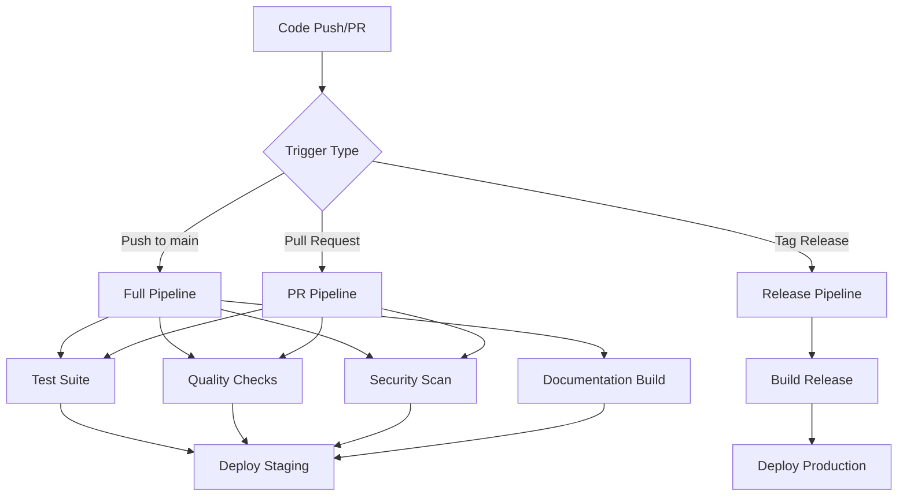

# CI/CD Pipeline Guide

## Overview

This document describes the comprehensive CI/CD pipeline implemented for the AHGD (Australian Health Geography Data) Analytics project. The pipeline ensures code quality, automated testing, security scanning, and reliable deployments.

## Pipeline Architecture



## Workflows

### 1. Test Suite (`test.yml`)

**Triggers:**
- Push to `main` or `develop` branches
- Pull requests to `main` or `develop`
- Daily scheduled runs (2 AM UTC)

**Jobs:**
- **Code Quality Checks**: Linting, formatting, type checking, security scanning
- **Cross-Platform Testing**: Ubuntu, macOS, Windows with Python 3.11, 3.12
- **Performance Tests**: Benchmark testing for performance regression detection
- **Dashboard Tests**: Streamlit application testing with UI validation

**Key Features:**
- Parallel execution across multiple OS and Python versions
- Comprehensive test coverage reporting
- Caching for faster builds
- Artifact upload for test results and coverage reports

### 2. Quality & Security (`quality.yml`)

**Triggers:**
- Push to `main` or `develop` branches
- Pull requests to `main` or `develop`  
- Weekly scheduled security scans (Sundays, 3 AM UTC)

**Jobs:**
- **Code Quality Analysis**: Multiple linters (ruff, flake8, pylint), complexity analysis
- **Security Scanning**: Bandit, safety, semgrep, and secret detection
- **Dependency Review**: Automated dependency vulnerability assessment
- **Documentation Quality**: Docstring and markdown quality checks
- **Coverage Analysis**: Test coverage reporting and quality gates

**Quality Gates:**
- No high-severity security vulnerabilities
- Code quality tools must pass
- Minimum test coverage requirements

### 3. Deployment (`deploy.yml`)

**Triggers:**
- Push to `main` branch (staging deployment)
- Release tags `v*` (production deployment)
- Manual workflow dispatch

**Jobs:**
- **Build Application**: Create deployment packages and Docker images
- **Deploy Staging**: Automated staging environment deployment
- **Deploy Production**: Production deployment with approval gates
- **Rollback Procedure**: Automated rollback on deployment failures

**Features:**
- Blue-green deployment strategy
- Health checks and validation
- Environment-specific configuration
- Container registry integration (GitHub Container Registry)

### 4. Documentation (`docs.yml`)

**Triggers:**
- Push to `main` or `develop` branches (when docs/ or code changes)
- Pull requests affecting documentation
- Manual workflow dispatch

**Jobs:**
- **Build Documentation**: Sphinx-based documentation generation
- **API Documentation**: Automated API documentation with pdoc
- **README Sync**: Automatic documentation updates from README changes
- **Quality Checks**: Markdown linting and link validation

**Output:**
- GitHub Pages deployment
- API documentation artifacts
- Documentation quality reports

### 5. Release Management (`release.yml`)

**Triggers:**
- Push tags matching `v*` pattern
- Manual workflow dispatch with version input

**Jobs:**
- **Release Validation**: Version format and tag availability checks
- **Full Test Suite**: Complete testing before release
- **Build Release Assets**: Source packages, deployment packages, checksums
- **GitHub Release Creation**: Automated release notes and asset uploads
- **Post-Release Tasks**: Version updates and development branch preparation

### 6. Dependency Updates (`dependency-update.yml`)

**Triggers:**
- Weekly scheduled runs (Mondays, 9 AM UTC)
- Manual workflow dispatch with update type selection

**Jobs:**
- **Dependency Check**: Automated detection of outdated packages
- **Security Updates**: Priority security vulnerability updates
- **Automated PR Creation**: Pull requests for dependency updates
- **Cleanup**: Automated branch cleanup for merged updates

## Development Workflow

### Pre-commit Hooks

The project uses pre-commit hooks for immediate feedback:

```bash
# Install pre-commit hooks
uv run pre-commit install

# Run manually
uv run pre-commit run --all-files
```

**Configured Hooks:**
- Code formatting (black, ruff)
- Linting (ruff, flake8, mypy)
- Security scanning (bandit)
- YAML/JSON validation
- Trailing whitespace removal
- Import sorting (isort)

### Local Development

```bash
# Install all dependencies
uv sync --all-groups

# Run tests locally
uv run pytest

# Run quality checks
uv run ruff check src/ scripts/ tests/
uv run black --check src/ scripts/ tests/
uv run mypy src/ scripts/

# Run security scan
uv run bandit -r src/ scripts/

# Start dashboard for testing
uv run streamlit run src/dashboard/app.py
```

### Pull Request Process

1. **Create Feature Branch**: 
   ```bash
   git checkout -b feature/your-feature-name
   ```

2. **Develop and Test**:
   ```bash
   # Make changes
   git add .
   git commit -m "feat: your feature description"
   
   # Push and create PR
   git push origin feature/your-feature-name
   ```

3. **Automated Checks**: Pipeline runs automatically on PR creation
4. **Code Review**: Team review using PR template
5. **Merge**: Automated merge after approval and passing checks

## Deployment Environments

### Staging Environment

- **Trigger**: Push to `main` branch
- **Purpose**: Integration testing and validation
- **URL**: `https://ahgd-staging.example.com`
- **Database**: Staging database with sample data
- **Monitoring**: Basic health checks and performance monitoring

### Production Environment

- **Trigger**: Release tags (`v*`) or manual deployment
- **Purpose**: Live application serving end users
- **URL**: `https://ahgd.example.com`
- **Database**: Production database with full datasets
- **Monitoring**: Comprehensive monitoring, alerting, and logging
- **Backup**: Automated backups and disaster recovery

## Configuration Management

### Environment Variables

| Variable | Description | Required | Default |
|----------|-------------|----------|---------|
| `AHGD_ENV` | Environment name | Yes | `development` |
| `AHGD_DB_PATH` | Database path | Yes | `health_analytics.db` |
| `AHGD_TEST_MODE` | Test mode flag | No | `false` |
| `PYTHONPATH` | Python path | Yes | `src/` |

### Secrets Management

Secrets are managed through GitHub Secrets:

- `GITHUB_TOKEN`: Automated workflows and deployments
- `CODECOV_TOKEN`: Coverage reporting
- `DOCKER_REGISTRY_TOKEN`: Container registry access
- `DEPLOYMENT_SSH_KEY`: Deployment server access

## Monitoring and Alerting

### GitHub Actions Monitoring

- **Workflow Status**: Real-time status in GitHub Actions tab
- **Notifications**: Email/Slack notifications for failures
- **Metrics**: Workflow duration and success rate tracking

### Application Monitoring

- **Health Checks**: Automated endpoint monitoring
- **Performance**: Response time and resource usage tracking
- **Logs**: Centralised logging with structured log format
- **Alerting**: Automated alerts for critical issues

## Troubleshooting

### Common Issues

1. **Test Failures**:
   ```bash
   # Check specific test failures
   uv run pytest tests/ -v --tb=long
   
   # Run specific test categories
   uv run pytest -m unit
   uv run pytest -m integration
   ```

2. **Quality Check Failures**:
   ```bash
   # Fix formatting issues
   uv run black src/ scripts/ tests/
   uv run ruff --fix src/ scripts/ tests/
   
   # Check specific quality issues
   uv run flake8 src/ scripts/ tests/
   uv run mypy src/ scripts/
   ```

3. **Security Issues**:
   ```bash
   # Check security vulnerabilities
   uv run bandit -r src/ scripts/
   uv run safety check
   
   # Update vulnerable dependencies
   uv lock --upgrade
   ```

4. **Deployment Failures**:
   - Check workflow logs in GitHub Actions
   - Verify environment variables and secrets
   - Review deployment health checks
   - Check container registry permissions

### Emergency Procedures

1. **Rollback Production**:
   ```bash
   # Trigger rollback workflow
   gh workflow run deploy.yml -f environment=production -f rollback=true
   ```

2. **Hotfix Deployment**:
   ```bash
   # Create hotfix branch from main
   git checkout -b hotfix/critical-fix main
   
   # Make minimal changes
   git commit -m "fix: critical security issue"
   
   # Tag and push for immediate deployment
   git tag v1.0.1-hotfix
   git push origin hotfix/critical-fix --tags
   ```

## Best Practices

### Code Quality

- **Write Tests First**: Test-driven development approach
- **Keep Functions Small**: Maximum 20 lines per function
- **Use Type Hints**: Complete type annotation coverage
- **Document Public APIs**: Google-style docstrings
- **Follow PEP 8**: Consistent code formatting

### Security

- **Never Commit Secrets**: Use environment variables and GitHub Secrets
- **Regular Updates**: Keep dependencies updated weekly
- **Principle of Least Privilege**: Minimal required permissions
- **Security Scanning**: Automated security checks on every commit

### Testing

- **Test Coverage**: Maintain >80% code coverage
- **Test Categories**: Unit, integration, and end-to-end tests
- **Test Data**: Use factories and fixtures for test data
- **Mock External Services**: No external dependencies in tests

### Deployment

- **Immutable Builds**: Docker containers with exact dependency versions
- **Health Checks**: Comprehensive application health validation
- **Gradual Rollouts**: Staged deployment with validation gates
- **Monitoring**: Comprehensive observability and alerting

## Performance Optimisation

### Build Performance

- **Caching**: Aggressive caching of dependencies and build artifacts
- **Parallel Execution**: Matrix builds across multiple environments
- **Selective Testing**: Smart test selection based on changed files
- **Artifact Reuse**: Reuse build artifacts across workflow jobs

### Application Performance

- **Performance Testing**: Automated benchmark testing
- **Resource Monitoring**: Memory and CPU usage tracking
- **Database Optimisation**: Query performance monitoring
- **Caching Strategy**: Multi-level caching implementation

## Compliance and Governance

### Audit Trail

- **Change Tracking**: Complete history of all code changes
- **Deployment Logs**: Detailed deployment and configuration logs
- **Access Logs**: User access and permission tracking
- **Security Events**: Security-related event logging

### Compliance Requirements

- **Data Privacy**: GDPR and privacy regulation compliance
- **Security Standards**: Industry security best practices
- **Audit Requirements**: Regular security and compliance audits
- **Documentation**: Comprehensive process documentation

---

## Quick Reference

### Common Commands

```bash
# Development setup
uv sync --all-groups
uv run pre-commit install

# Testing
uv run pytest                    # Run all tests
uv run pytest -m unit          # Unit tests only
uv run pytest --cov=src        # With coverage

# Quality checks
uv run ruff check .             # Linting
uv run black --check .          # Formatting check
uv run mypy src/               # Type checking

# Security
uv run bandit -r src/          # Security scan
uv run safety check            # Dependency vulnerabilities

# Documentation
uv run sphinx-build docs/ docs/_build/  # Build docs

# Deployment
docker build -t ahgd .         # Build container
docker run -p 8501:8501 ahgd   # Run locally
```

### Workflow Triggers

| Event | Workflows Triggered |
|-------|-------------------|
| Push to main | test.yml, quality.yml, deploy.yml (staging), docs.yml |
| Pull request | test.yml, quality.yml |
| Release tag | release.yml, deploy.yml (production) |
| Schedule | dependency-update.yml, quality.yml (security) |
| Manual | All workflows (via workflow_dispatch) |

This CI/CD pipeline ensures reliable, secure, and high-quality software delivery for the AHGD Health Analytics platform.