# AHGD Data Model Diagram

Below is a comprehensive data model diagram for the Australian Healthcare Geographic Database (AHGD) that shows all dimension and fact tables with their relationships. This visualization is designed to help data architects understand the overall structure and relationships in the dimensional model.

## Entity Relationship Diagram

```mermaid
erDiagram
    GEO_DIMENSION {
        int geo_sk PK
        string geo_code
        string geo_name
        string geo_type
        string geo_category
        string state_code
        string state_name
        binary geometry
        timestamp etl_processed_at
    }
  
    TIME_DIMENSION {
        int time_sk PK
        date full_date
        int year
        int quarter
        int month
        string month_name
        int day_of_month
        int day_of_week
        string day_name
        string financial_year
        bool is_weekday
        bool is_census_year
        timestamp etl_processed_at
    }
  
    HEALTH_CONDITION_DIMENSION {
        int condition_sk PK
        string condition
        string condition_name
        string condition_category
        timestamp etl_processed_at
    }
  
    DEMOGRAPHIC_DIMENSION {
        int demographic_sk PK
        string age_group
        string sex
        string sex_name
        int age_min
        int age_max
        timestamp etl_processed_at
    }
  
    PERSON_CHARACTERISTIC_DIMENSION {
        int characteristic_sk PK
        string characteristic_type
        string characteristic_code
        string characteristic_name
        string characteristic_category
        timestamp etl_processed_at
    }
  
    FACT_POPULATION {
        int geo_sk FK
        int time_sk FK
        int total_persons
        int total_male
        int total_female
        int total_indigenous
        timestamp etl_processed_at
    }
  
    FACT_INCOME {
        int geo_sk FK
        int time_sk FK
        int low_income_count
        int medium_income_count
        int high_income_count
        int income_not_stated_count
        timestamp etl_processed_at
    }
  
    FACT_HEALTH_CONDITIONS_DETAILED {
        int geo_sk FK
        int time_sk FK
        string condition
        string age_group
        string sex
        int count
        timestamp etl_processed_at
    }
  
    FACT_HEALTH_CONDITIONS_REFINED {
        int geo_sk FK
        int time_sk FK
        int condition_sk FK
        int demographic_sk FK
        int count
        timestamp etl_processed_at
    }
  
    FACT_HEALTH_CONDITIONS_BY_CHARACTERISTIC {
        int geo_sk FK
        int time_sk FK
        string condition
        string characteristic_type
        string characteristic_code
        int count
        timestamp etl_processed_at
    }
  
    FACT_HEALTH_CONDITIONS_BY_CHARACTERISTIC_REFINED {
        int geo_sk FK
        int time_sk FK
        int condition_sk FK
        int characteristic_sk FK
        int count
        timestamp etl_processed_at
    }
  
    FACT_UNPAID_ASSISTANCE {
        int geo_sk FK
        int time_sk FK
        int provided_unpaid_care_count
        int did_not_provide_unpaid_care_count
        int unpaid_care_not_stated_count
        timestamp etl_processed_at
    }
  
    GEO_DIMENSION ||--o{ FACT_POPULATION : "geo_sk"
    TIME_DIMENSION ||--o{ FACT_POPULATION : "time_sk"
  
    GEO_DIMENSION ||--o{ FACT_INCOME : "geo_sk"
    TIME_DIMENSION ||--o{ FACT_INCOME : "time_sk"
  
    GEO_DIMENSION ||--o{ FACT_HEALTH_CONDITIONS_DETAILED : "geo_sk"
    TIME_DIMENSION ||--o{ FACT_HEALTH_CONDITIONS_DETAILED : "time_sk"
  
    GEO_DIMENSION ||--o{ FACT_HEALTH_CONDITIONS_REFINED : "geo_sk"
    TIME_DIMENSION ||--o{ FACT_HEALTH_CONDITIONS_REFINED : "time_sk"
    HEALTH_CONDITION_DIMENSION ||--o{ FACT_HEALTH_CONDITIONS_REFINED : "condition_sk"
    DEMOGRAPHIC_DIMENSION ||--o{ FACT_HEALTH_CONDITIONS_REFINED : "demographic_sk"
  
    GEO_DIMENSION ||--o{ FACT_HEALTH_CONDITIONS_BY_CHARACTERISTIC : "geo_sk"
    TIME_DIMENSION ||--o{ FACT_HEALTH_CONDITIONS_BY_CHARACTERISTIC : "time_sk"
  
    GEO_DIMENSION ||--o{ FACT_HEALTH_CONDITIONS_BY_CHARACTERISTIC_REFINED : "geo_sk"
    TIME_DIMENSION ||--o{ FACT_HEALTH_CONDITIONS_BY_CHARACTERISTIC_REFINED : "time_sk"
    HEALTH_CONDITION_DIMENSION ||--o{ FACT_HEALTH_CONDITIONS_BY_CHARACTERISTIC_REFINED : "condition_sk"
    PERSON_CHARACTERISTIC_DIMENSION ||--o{ FACT_HEALTH_CONDITIONS_BY_CHARACTERISTIC_REFINED : "characteristic_sk"
  
    GEO_DIMENSION ||--o{ FACT_UNPAID_ASSISTANCE : "geo_sk"
    TIME_DIMENSION ||--o{ FACT_UNPAID_ASSISTANCE : "time_sk"
```

## Star Schema Visualization

## Data Flow Visualization

These diagrams can be rendered in any Markdown viewer that supports Mermaid syntax, such as GitHub, GitLab, or dedicated documentation tools. They provide different perspectives on the data model for different stakeholders:

1. The Entity Relationship Diagram shows detailed table structures with primary and foreign keys
2. The Star Schema Visualization shows the relationships between dimension and fact tables
3. The Data Flow Visualization shows how data moves through the ETL process into the final outputs
