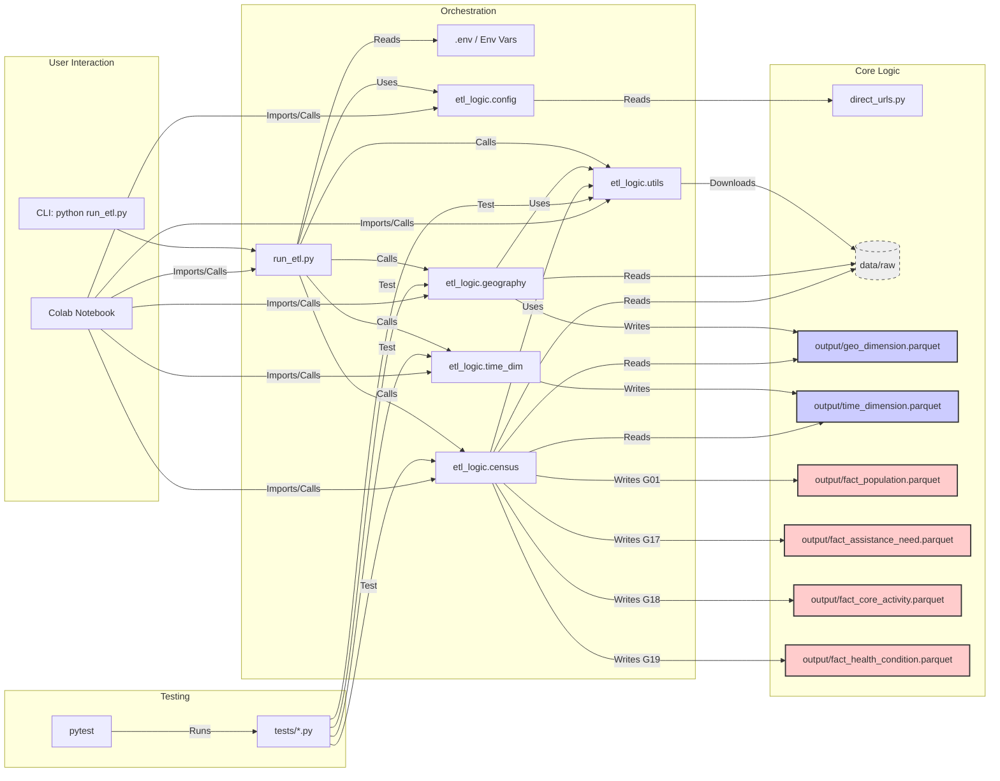
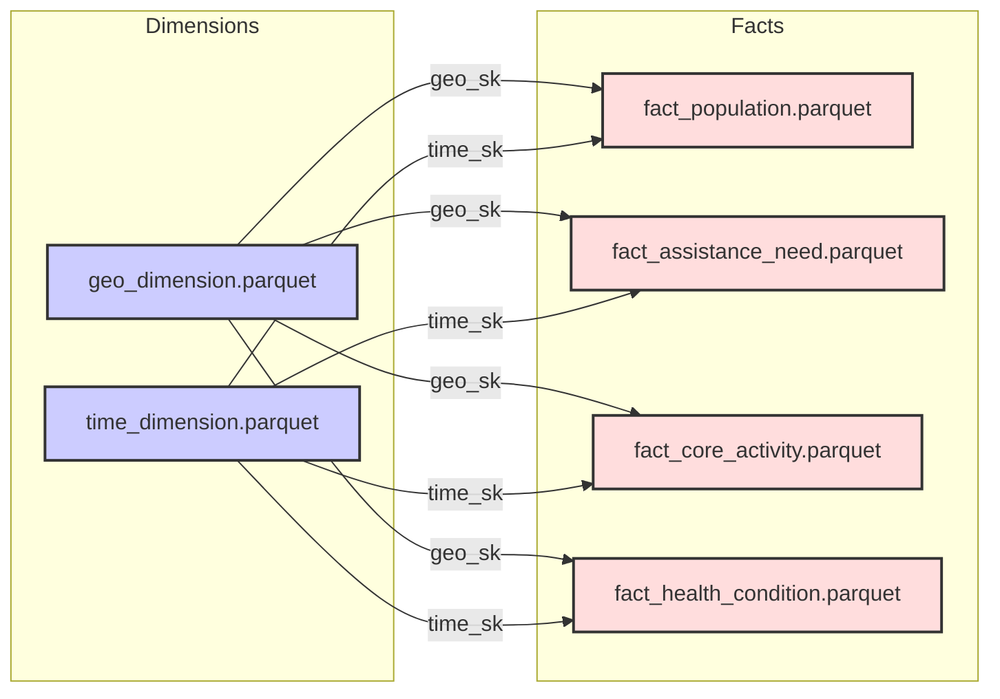

# System Patterns: AHGD ETL Refactoring

*This file details the system architecture, design patterns, key technical decisions, and component relationships for the refactored AHGD ETL pipeline.*

## Architecture Overview

The system follows an ETL (Extract, Transform, Load) pipeline architecture focused on processing ABS data into Parquet files suitable for downstream analysis. The refactored structure aims for modularity and clear separation of concerns, runnable both locally and in Colab.

**Original Structure:**

```
AHGD3/
├── .env                 # Local environment configuration (e.g., BASE_DIR)
├── data/                # Root for local data storage (raw, temp)
│   ├── raw/
│   │   ├── geographic/  # Downloaded ASGS zips
│   │   └── census/      # Downloaded Census zips
│   └── temp/            # Temporary extraction folders
├── etl_logic/           # Core ETL processing logic package
│   ├── __init__.py
│   ├── config.py        # Configuration loading (paths, URLs)
│   ├── utils.py         # Helper functions (download, extract, clean)
│   ├── geography.py     # ASGS shapefile processing
│   ├── census.py        # Generic Census data processing functions
│   └── time_dim.py      # Time dimension generation
├── output/              # Generated Parquet files
│   ├── geo_dimension.parquet
│   ├── time_dimension.parquet
│   ├── fact_population.parquet
│   ├── fact_assistance_need.parquet
│   ├── fact_core_activity.parquet 
│   └── fact_health_condition.parquet
├── tests/               # Pytest test suite
│   ├── fixtures/        # Test data
│   └── test_*.py        # Test modules
├── memory-bank/         # Project context documentation
├── direct_urls.py       # Centralised ABS data URLs
├── run_etl.py           # Main CLI entry point for orchestration
├── requirements.txt     # Python dependencies
├── setup.py             # Package setup
└── README.md            # Project overview
```

**New Migrated Structure:**

```
AHGD/
├── data_files/          # All data input and output files
│   ├── raw/             # Downloaded raw data
│   │   ├── geographic/  # Downloaded ASGS zips
│   │   └── census/      # Downloaded Census zips
│   └── output/          # Generated Parquet files
│       ├── geo_dimension.parquet
│       ├── time_dimension.parquet
│       ├── fact_population.parquet
│       ├── fact_assistance_need.parquet
│       ├── fact_core_activity.parquet 
│       └── fact_health_condition.parquet
├── app/                 # All code and documentation
│   ├── .env             # Local environment configuration
│   ├── etl_logic/       # Core ETL processing logic package
│   │   ├── __init__.py
│   │   ├── config.py    # Configuration loading (paths, URLs)
│   │   ├── utils.py     # Helper functions (download, extract, clean)
│   │   ├── geography.py # ASGS shapefile processing
│   │   ├── census.py    # Generic Census data processing functions
│   │   └── time_dim.py  # Time dimension generation
│   ├── scripts/         # Utility scripts
│   │   ├── download_sample_data.py
│   │   ├── test_g17_g18_processing.py
│   │   └── analysis/    # Analysis scripts
│   ├── tests/           # Pytest test suite
│   │   ├── fixtures/    # Test data
│   │   └── test_*.py    # Test modules
│   ├── documentation/   # Project documentation
│   │   └── project/     # Core project documentation
│   │       ├── projectbrief.md
│   │       ├── productContext.md
│   │       ├── systemPatterns.md
│   │       ├── techContext.md
│   │       └── dataStructures.md
│   ├── logs/            # Log files directory
│   ├── src/             # Source modules
│   ├── direct_urls.py   # Centralised ABS data URLs
│   ├── run_etl.py       # Main CLI entry point for orchestration
│   ├── extract_g21_metadata.py # Metadata extraction utility
│   ├── requirements.txt # Python dependencies
│   ├── setup.py         # Package setup
│   ├── .gitignore       # Git ignore configuration
│   └── README.md        # Project overview
```

## Key Design Patterns

*   **Clean Separation of Data and Code:** The new structure clearly separates data files from code and documentation.
*   **ETL Pipeline:** The core workflow follows Extract (downloading zips), Transform (cleaning, standardising geo and census data), and Load (writing Parquet files).
*   **Modular Package (`etl_logic`):** Core logic is encapsulated within a Python package, promoting reusability (e.g., by `run_etl.py` and Colab notebooks).
*   **Configuration Management:**
    *   Centralised URLs (`direct_urls.py`).
    *   Path and parameter configuration (`etl_logic/config.py`).
    *   Environment-aware base path resolution (using `.env` locally, set explicitly in Colab).
*   **Utility Helpers (`etl_logic/utils.py`):** Common functions for downloading, extraction, logging, and data cleaning are centralised.
*   **Resource Management:** Proper cleanup of temporary resources using try-finally blocks to ensure reliable operation even when errors occur.
*   **Performance Optimisation:** Using vectorised operations instead of row-by-row processing for improved speed and memory efficiency.
*   **CLI Orchestrator (`run_etl.py`):** A command-line interface provides a single point for running the ETL steps locally.
*   **Target Data Model (Star Schema):** The warehouse follows a dimensional model (star schema) as outlined in `datadicttext.md`:
    *   **Dimension tables:** `geo_dimension.parquet`, `time_dimension.parquet`, populated from ASGS shapefiles and configuration respectively
    *   **Fact tables:** `fact_population.parquet`, `fact_assistance_need.parquet`, `fact_core_activity.parquet`, `fact_health_condition.parquet` — all populated from Census data and linked to dimensions
    *   **Surrogate Key Pattern:** Dimension tables use surrogate keys (e.g., `geo_sk`, `time_sk`) that are referenced as foreign keys in fact tables
*   **Hybrid Data Processing (GeoPandas + Polars):** Uses GeoPandas for initial shapefile reading and geometric operations, then converts to Polars for efficient tabular manipulation and Parquet writing.
*   **Flexible Column Mapping:** ABS data files may have variations in column naming, so the census processing modules use flexible column mapping with alternatives to accommodate these differences.
*   **Vertical Slice Implementation:** Each Census table is implemented as a complete slice from configuration pattern to output file, allowing incremental functionality delivery.
*   **Generic Processing Functions:** Standardized processing functions that can handle multiple Census tables through configuration.
*   **Data Quality Validation:** Built-in data quality checks throughout the ETL process.

## Component Breakdown

*   **`run_etl.py` (Orchestrator):**
    *   Parses CLI arguments.
    *   Initialises configuration (reads `.env`, sets paths).
    *   Calls download, geography processing, and census processing functions in sequence.
    *   Provides specific steps for each Census table (e.g., `census_g01`, `census_g17`).
*   **`direct_urls.py` (Data Sources):**
    *   Provides URLs for ABS data.
    *   Includes helper functions for URL verification and file checksum validation.
*   **`etl_logic.config` (Configuration):**
    *   Defines relative paths.
    *   Specifies target geographic levels and Census tables.
    *   Defines regex patterns for identifying Census CSV files.
    *   Provides functions to resolve absolute paths based on `BASE_DIR`.
    *   Defines time dimension configuration.
*   **`etl_logic.utils` (Utilities):**
    *   `download_file`, `extract_zipfile`, `download_data`: Handle data acquisition.
    *   `setup_logging`: Configures logging.
    *   Data cleaning functions (e.g., `clean_geo_code`, `safe_polars_int`, `geometry_to_wkt`).
    *   `find_geo_column`: Flexible identification of geo columns across different naming patterns.
*   **`etl_logic.geography` (Geo Processor):**
    *   Extracts shapefiles.
    *   Reads with GeoPandas.
    *   Validates geometries, converts to WKT.
    *   Transforms to Polars DataFrame.
    *   Combines levels into `geo_dimension.parquet`.
*   **`etl_logic.time_dim` (Time Dimension):**
    *   Generates a time dimension table based on configuration.
    *   Supports different date attributes (year, quarter, month, day).
    *   Includes Australian financial year (July-June format).
    *   Provides Census year flag for filtering.
    *   Creates surrogate keys (time_sk) for dimension-fact relationships.
*   **`etl_logic.census` (Census Processor):**
    *   **Generic Processing Function (`process_census_table`):**
        *   Takes table identifier, column mapping, and processing function.
        *   Finds and extracts Census CSVs from zips.
        *   Reads with Polars.
        *   Applies custom processing logic.
        *   Joins with dimensions using surrogate keys.
        *   Validates data quality.
        *   Writes output to Parquet.
    *   **G01 Processing:**
        *   Converts population data to fact table format.
        *   Integrates with geo_dimension and time_dimension.
        *   Produces `fact_population.parquet`.
    *   **G17 Processing:**
        *   Processes personal income data.
        *   Uses standard process_census_table function.
        *   Produces `fact_assistance_need.parquet`.
    *   **G18 Processing:**
        *   Processes core activity need for assistance data.
        *   Uses standard process_census_table function.
        *   Produces `fact_core_activity.parquet`.
    *   **G19 Processing:**
        *   Processes long-term health conditions data.
        *   Handles multi-file input (G19A, G19B, G19C).
        *   Uses standard process_census_table function.
        *   Produces `fact_health_condition.parquet`.
*   **`tests/` (Testing):**
    *   Uses `pytest`.
    *   Contains unit tests for utilities and core logic.
    *   Contains integration tests for parts of the ETL flow using test data.
    *   Includes mock data fixtures that simulate ABS file formats.
    *   Tests STATE level geographic code handling.
    *   Tests data quality validations.

## Key Technical Decisions

*   **Python:** Primary programming language.
*   **Polars:** Chosen for efficient large file processing and Parquet I/O.
*   **GeoPandas/Shapely:** Used for initial spatial data reading and validation due to mature shapefile support.
*   **Parquet:** Selected as the output format for efficiency and compatibility with data analysis tools.
*   **`.env` / Environment Variables:** For managing environment-specific configuration (like `BASE_DIR`).
*   **`pytest`:** Standard Python testing framework for ensuring code quality and correctness.
*   **CLI Entry Point:** Provides a standard way to run the ETL locally.
*   **Modular Design:** Separating logic into the `etl_logic` package allows reuse by different runners (local CLI, Colab).
*   **Star Schema Design:** Using dimension and fact tables with surrogate keys for a proper data warehouse architecture.
*   **Surrogate Keys:** Implementing surrogate keys (`geo_sk`, `time_sk`) to enable proper dimension-fact relationships and prepare for future dimension growth.
*   **Flexible Column Mapping:** Implementing alternative column name checking to handle ABS inconsistencies in naming.
*   **Census Pattern Detection:** Robust regex patterns for identifying column types and extracting relevant information across different Census tables.
*   **Special Geographic Code Handling:** Implementing filter_special_geo_codes utility to handle non-standard geographic codes using explicit patterns rather than backreferences for compatibility with Polars regex engine.
*   **Unpivoting Strategy:** Developing a flexible unpivoting approach for wide-format Census tables to convert them to analysis-friendly long format.
*   **Generic Processing Functions:** Standard processing function for different Census tables to ensure consistency.
*   **Data Quality Validation:** In-process validation to ensure data integrity.
*   **Coding Standards:** Using Australian English spelling consistently throughout the codebase.
*   **Logging Configuration:** Preventing duplicate log entries by setting `logger.propagate = False` and standardising log formatters.
*   **Resource Management:** Using try-finally blocks to ensure proper cleanup of temporary resources, even when errors occur.
*   **Vectorised Operations:** Replacing row-by-row processing with vectorised operations for improved performance.

## Component Relationships (Simplified Flow)



## Data Model (Star Schema)

The implemented data model follows a star schema approach:



## Census Data Handling Patterns

### Generic Census Table Processing Pattern

To standardize the processing of all Census tables, we've implemented a generic processing approach:

```python
def process_census_table(
    table_id: str,
    census_zip_path: str,
    geo_df: pl.DataFrame,
    time_sk: int,
    output_path: str,
    column_mapping: Dict[str, Any],
    process_function: Callable,
    geo_level: str = "SA2",
) -> pl.DataFrame:
    """
    Generic function to process a Census table from a zip file.
    
    Args:
        table_id: Census table identifier (e.g., 'G01', 'G17')
        census_zip_path: Path to the Census zip file
        geo_df: DataFrame containing geographic dimension data
        time_sk: Time dimension surrogate key
        output_path: Path to save the output Parquet file
        column_mapping: Dictionary mapping source columns to target columns
        process_function: Function that performs the actual processing logic
        geo_level: Geographic level to process
        
    Returns:
        DataFrame containing the processed data
    """
    # Find and extract relevant files
    # Read files into DataFrames
    # Apply custom processing function
    # Join with geo_dimension using surrogate key
    # Add time_sk
    # Validate data quality
    # Write to Parquet
    # Return processed DataFrame
```

This generic approach ensures:
1. Consistent processing across all Census tables
2. Standardized integration of time and geographic dimensions
3. Centralized data quality validation
4. Reduced code duplication

### Flexible Column Mapping Pattern

To handle the inconsistencies in the ABS Census data, we've implemented a flexible column mapping pattern:

1. **Pattern Identification:**
   - Analyze metadata files to understand column naming patterns
   - Identify variations and inconsistencies in column names
   - Document these patterns for each Census table (G17, G18, G19)

2. **Dynamic Column Mapping:**
   - For each expected column, check multiple possible naming variations
   - Fall back to alternative names if the primary name isn't found
   - Handle typos and inconsistencies in the original data

3. **Implementation Example:**
   ```python
   # Check different possible column formats
   possible_cols = [
       f"{gender}_{age}_Need_for_assistance",
       f"{gender}_{age}_yrs_Need_for_assistance"
   ]
   
   for col in possible_cols:
       if col in df.columns:
           matching_col = col
           break
   ```

4. **Standardized Output:**
   - Transform all variations into standardized column names
   - Use consistent prefixes (g17_, g18_, g19_) for easy identification
   - Apply consistent naming patterns across all output files

### Split File Handling (G19)

For G19 (Health Conditions) data that is split across multiple files:

1. **Multi-file Collection:**
   - Identify all relevant files (G19A, G19B, G19C)
   - Load each file into separate DataFrames

2. **Column Discovery:**
   - Search for columns across all DataFrames
   - When a matching column is found, extract it to the result

3. **Implementation:**
   ```python
   # Try to find this column in any of the G19 DataFrames
   for df in g19_dfs:
       if column_name in df.columns:
           result[standardized_name] = df[column_name]
           break
   ```

### Geographic Hierarchy 

We handle geographic regions using a hierarchical structure:

1. **Geographic Levels:**
   - SA1 (Statistical Area Level 1)
   - SA2 (Statistical Area Level 2)
   - SA3 (Statistical Area Level 3)
   - SA4 (Statistical Area Level 4)
   - STATE

2. **Surrogate Keys:**
   - Each geographic entity has a surrogate key (geo_sk)
   - Fact tables link to geo_dimension using this key

3. **STATE Level Handling:**
   - Support for different STATE code formats (single-digit and two-digit)
   - Enhanced column name detection for STATE level data
   - Clean state codes to ensure proper joining

### Time Dimension Integration

Each fact table is now integrated with a time dimension:

1. **Time Dimension Structure:**
   - Surrogate key (time_sk) for joining
   - Calendar date attributes (year, quarter, month, day)
   - Australian financial year (July-June)
   - Census year flag for filtering
   - Weekday/weekend classification

2. **Census Reference Date:**
   - Each Census table is associated with a reference date
   - Time dimension surrogate key is passed to all fact tables
   - All fact tables include time_sk for time-based analysis

3. **Implementation:**
   ```python
   # Add time dimension surrogate key to all fact tables
   result = result.with_column(pl.lit(time_sk).alias("time_sk"))
   ```

## Processing Patterns

### File Discovery Pattern

To find relevant files within ZIP archives:

```python
with zipfile.ZipFile(census_zip_path, 'r') as z:
    # Find relevant files (e.g., G18 files for Australia)
    relevant_files = []
    for filename in z.namelist():
        if "G18" in filename and "AUS_AUS" in filename:
            relevant_files.append(filename)
```

### Data Quality Validation Pattern

To ensure data integrity during processing:

```python
def validate_data_quality(df: pl.DataFrame, table_id: str) -> None:
    """Validate data quality for a processed Census table"""
    # Check for expected columns
    required_columns = ["geo_sk", "time_sk"]
    for col in required_columns:
        if col not in df.columns:
            raise ValueError(f"Required column {col} missing from {table_id} output")
    
    # Check for null values in key columns
    null_counts = df.select([
        pl.col("geo_sk").is_null().sum().alias("geo_sk_nulls"),
        pl.col("time_sk").is_null().sum().alias("time_sk_nulls")
    ]).collect()
    
    if null_counts[0, "geo_sk_nulls"] > 0:
        raise ValueError(f"Found {null_counts[0, 'geo_sk_nulls']} null values in geo_sk")
    
    if null_counts[0, "time_sk_nulls"] > 0:
        raise ValueError(f"Found {null_counts[0, 'time_sk_nulls']} null values in time_sk")
    
    # Check for expected row count
    if df.height == 0:
        raise ValueError(f"Processed {table_id} data has 0 rows")
```

### Age Group Standardization Pattern

To standardize age groups across different Census tables:

```python
age_groups = {
    "0_4": ["0_4"],
    "5_14": ["5_14"],
    "15_24": ["15_19", "20_24"],  # Combine these age groups
    "25_34": ["25_34"],
    # ... other age groups ...
}
```

### Metadata-Driven Processing Pattern

Our system uses metadata analysis to inform ETL design:

1. **Metadata Analysis:**
   - Examine ABS metadata files to understand structure
   - Identify column patterns and variations
   - Document expected data formats

2. **ETL Implementation:**
   - Use identified patterns to guide column selection
   - Implement flexible handling of variations
   - Transform to standardized structure

3. **Documentation:**
   - Maintain metadata documentation in Memory Bank
   - Include known issues and variations
   - Document standardization approach

This metadata-driven approach allows us to handle the complexities of ABS Census data while producing a consistent, standardized output for analysis.